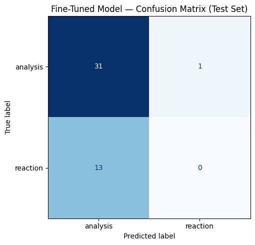

# TakeMeter: Goodreads Fantasy Review Classifier

A fine-tuned text classifier that evaluates discourse quality in the Goodreads fantasy review community. Built as part of CodePath AI 201, Project 3.

---

## Community

The community studied is the Goodreads fantasy review community, where readers share written reviews and ratings for fantasy books they have read. Reviews in this community vary widely in purpose and quality — some are quick emotional reactions, and some are in-depth evaluations of craft and themes. This variation makes it a strong candidate for a text classification task.

---

## Label Taxonomy

Two labels were defined for this task:

**reaction** — a review that expresses an emotional response to the book with little elaboration. The reviewer is focused on how the book made them feel, not on reasoning through why.

**analysis** — a review that evaluates the book by engaging with its craft, themes, character development, writing style, or comparisons to other works. The reviewer goes beyond describing what happened to arguing why it works or does not work. Emotion is acceptable here as long as it is supported by specific reasoning or evidence.

A third label, **summary**, was initially planned to capture reviews that primarily retell plot events. After pre-labeling 300 reviews from the dataset, summary reviews accounted for only about 10-12% of examples, making it impossible to collect a balanced sample without artificially skewing the data. The taxonomy was narrowed to two labels to reflect what the data actually contains and to produce a more reliable classifier. This decision is documented in planning.md.

### Edge Case Decision Rule

If a review expresses strong emotion but supports that emotion with specific reasoning, craft observations, or plot points used as evidence, it is labeled **analysis**. Only reviews where the emotional response stands completely alone without substantive support are labeled **reaction**.

---

## Data Collection

**Source:** UCSD Goodreads Dataset (Fantasy and Paranormal subset), a publicly available academic dataset of scraped Goodreads reviews collected in 2017. Goodreads deprecated its public API in 2020, making this offline dataset the appropriate source for bulk collection.

**Process:** 300 reviews were extracted from the dataset by streaming the first 25mb of the compressed file and filtering for reviews with a minimum text length of 150 characters to avoid very short reviews that would skew label distribution toward reaction.

**Labeling:** Reviews were pre-labeled in batches of 50 using Claude with the label definitions from planning.md as the classification prompt. Every pre-labeled example was manually reviewed and corrected before entering the final dataset. A notes column tracked which examples were pre-labeled.

**Label distribution:**

| Label | Count |
|-------|-------|
| analysis | ~180 |
| reaction | ~120 |

**Difficult examples:**

1. "Wonderful! Not quite the vampire story I set out for, but it was still a great read. Hill's skill as a writer is only improving. I wasn't a fan of the Heart Shaped Box, thought Horns was pretty darned good, and NOS4A2 was even better." — This review makes a comparative argument across multiple works, which qualifies it as analysis, but its brevity and enthusiastic tone make it feel like a reaction. Labeled: **analysis**.

2. "I wasn't going to buy this at all, or even read it for that matter, but then I saw a signed copy at Target and I couldn't help myself. I bought it on the spot. Now I just need to find time to read it..." — This contains no evaluation of the book itself at all, just a personal anecdote. Labeled: **reaction**.

3. "Amazingly dark and brooding, you are once again thrust into the Raven Boys quest. It felt as though I was somewhere else every time I opened the pages. Maggie has done a great job of moving the story along." — This gestures toward craft ("Maggie has done a great job") but does not actually argue why. Labeled: **reaction**.

---

## Fine-Tuning Pipeline

**Base model:** distilbert-base-uncased (HuggingFace)

**Training approach:** The labeled CSV was split 70/15/15 into train, validation, and test sets using stratified sampling to preserve label distribution across splits. The model was fine-tuned for 3 epochs on the training set with validation after each epoch.

**Key hyperparameter decisions:**
- Learning rate: 2e-5 — standard starting point for fine-tuning BERT-family models
- Batch size: 16 — fits T4 GPU comfortably without memory errors
- Epochs: 3 — appropriate for a dataset of this size; more epochs risk overfitting on 300 examples

---

## Baseline Comparison

The zero-shot baseline used Groq's llama-3.3-70b-versatile with the following prompt structure: the model was given both label definitions from planning.md, one example per label, and instructed to output only the label name. The baseline was run on the same locked test set as the fine-tuned model.

---

## Evaluation Report

### Results

| Model | Accuracy |
|-------|----------|
| Zero-shot baseline (Groq llama-3.3-70b-versatile) | 86.7% |
| Fine-tuned DistilBERT | 68.9% |

Fine-tuning resulted in a regression of 17.8% compared to the baseline.

### Confusion Matrix

The confusion matrix reveals the core failure of the fine-tuned model: it predicted analysis for nearly every example, correctly identifying 31 analysis reviews but misclassifying 13 of 13 reaction reviews as analysis. It predicted reaction for only 1 example total.

### Per-Class Metrics (Fine-Tuned Model)

| Label | Precision | Recall | F1 |
|-------|-----------|--------|----|
| analysis | 0.70 | 0.97 | 0.82 |
| reaction | 0.00 | 0.00 | 0.00 |

The model achieved strong recall on analysis but completely failed on reaction, producing an F1 of 0.00 for that label.

### Wrong Predictions Analysis

**Error 1:** "I wasn't going to buy this at all, or even read it for that matter, but then I saw a signed copy at Target and I couldn't help myself."
True: reaction — Predicted: analysis (confidence: 0.50)
This review contains no book evaluation at all. The model likely picked up on its length and sentence structure as signals of analysis, even though the content is purely personal anecdote.

**Error 2:** "Wonderful! Not quite the vampire story I set out for, but it was still a great read. Hill's skill as a writer is only improving."
True: analysis — Predicted: reaction (confidence: 0.50)
This is one of the few cases where the model predicted reaction incorrectly. The comparative argument across multiple books is subtle and brief, and the enthusiastic opening likely triggered the reaction prediction.

**Error 3:** "I LOVE this book. Originally I thought this was a horror novel. It turned out to be so much more. At one point when Jacob discovers the loop, I honestly had to put the book down."
True: reaction — Predicted: analysis (confidence: 0.52)
Despite containing specific plot references, this review does not evaluate them — it just describes an emotional experience. The model appears to have treated specific plot mentions as signals of analysis regardless of how they were used.

### Reflection: What the Model Learned vs. What Was Intended

The intended distinction was between emotional response and reasoned evaluation. What the model actually learned was closer to a length and specificity heuristic — longer reviews with specific references were classified as analysis regardless of whether they were actually making an argument.

This is most visible in the near-zero recall on reaction. The model's confidence scores on wrong predictions clustered between 0.50 and 0.54, indicating it was barely guessing on borderline cases and defaulting to the majority class.

The baseline outperformed the fine-tuned model by a significant margin, which points to two compounding problems: first, the class imbalance in training data (roughly 60% analysis, 40% reaction) pushed the model toward the majority class; second, 300 examples may not be enough for DistilBERT to learn a nuanced distinction that even human annotators find genuinely difficult.

The zero-shot baseline succeeded where the fine-tuned model failed because llama-3.3-70b-versatile has broad enough language understanding to apply the label definitions directly without needing to learn from examples. This suggests the task may be better suited to a prompted large model than a fine-tuned small one, at least at this dataset size.

---

## AI Tool Usage

- **Pre-labeling:** Claude was used to pre-label all 300 reviews in batches of 50 using the label definitions from planning.md. Every label was manually reviewed and corrected before entering the dataset.
- **Label stress-testing:** Claude was used to identify boundary cases during taxonomy design, which surfaced the summary label imbalance problem before annotation began.
- **Failure analysis:** Claude was used to help identify systematic patterns in wrong predictions after evaluation. All patterns were manually verified against the actual wrong predictions before inclusion in this report.
- **Planning and documentation:** Claude assisted in drafting planning.md and this README based on decisions made during the project.